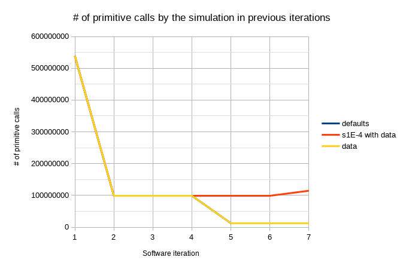
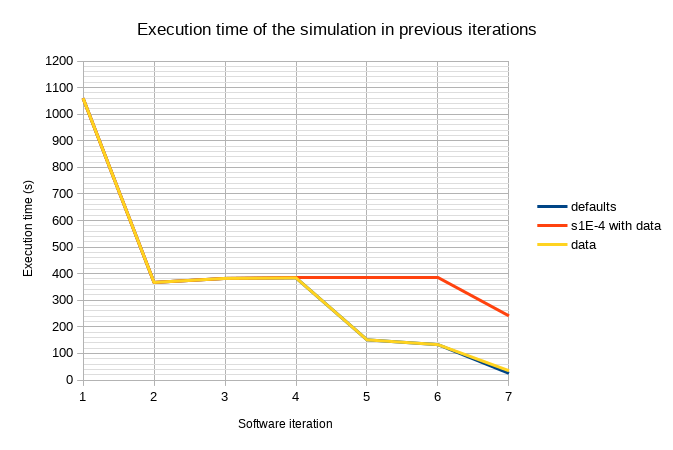
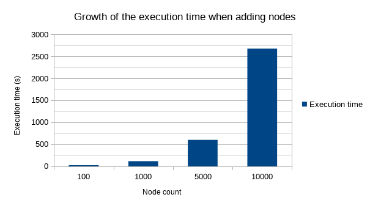

# Description

These are the simulation's profiling runs, profiled with cProfile. They're all ordered by the number of calls.

They're taken on the same machine running OpenSUSE Leap 15.1 with Conda's Python 3.8.2. If a profile is built on another operating system, it will be mentioned in the commit message.

They're created using the command: `python -m cProfile -s ncalls ./network_script.py -Np (args...)`. Changes to -c, -t or -j are described in the title, otherwise the program's defaults are used.

`memory_info.txt` and `cpu_info.txt` show the output of lsmem and lscpu respectively.

`archive/profileN.txt` show the profile for the default settings through previous iterations of this software. Be careful, the default timestep was changed without notice, so the earlier values should be compared with `profile_s1E-4.txt`

`profile.txt`, `profile_c12.txt` and `profile_s1E-4.txt` will be kept up to date with each meaningful change.

The profiles are built with a generated artificial pore network with 100 nodes of random properties. The random factor shouldn't add much uncertainty to the speed of the simulation.

# Simulation History

## Number of primitive calls

## Execution time

# Exponential node count

## Watts-Strogatz model

